# 호김심 많은 탐험가, 경험많은 신입

 

* 이름: 김기현

* 생년월일: 1993.12.05

* :telephone_receiver:: 010-5046-9622

* :email:: kimkihyun1205@gamil.com

* :notebook:: https://velog.io/@wimes

* : https://github.com/kiryun

  

### 간략한 소개

중학교 3학년때 부터 프로그래밍을 시작해서 지금까지 여러 분야에 대한 경험을 해본 프로그래머 입니다.
게임, IoT, iOS/Android, REST API Server분야의 프로젝트를 맡아서 한 경험이 있습니다.
다양한 프로젝트를 해본덕분에 다른 분야에서 응용해서 사용할 수 있었습니다.
새로운 기술을 배우는 것에 호기심과 열정을 가지고 있고 배우는데 있어서 겁먹지 않고 유연하게 배울 수 있는 자세가 준비되어있습니다.


### 경험해본 기술스택

* iOS

  Swift4

* Android

  Java

* REST API Server

  Node.js

* DataBase

  MySQL

* Data Science

  Python, pandas

* IoT

  Embedded System Programming, Memory Tuning, C, C++, NASM

* Game

  Unity3D, Direct3D 9

* ETC.

  Slack, Redmine

  

### 경력

* **(주)퀀텀게이트(2016.06 ~ 2017.08)**
  * Embedded System Engineer
    * 스쿨존용 IoT기반 차량과속경보 시스템 프로젝트, HW 부품 연결을 위한 메인 Linux SW개발과 Radar 프로토콜을 분석했습니다.
    * 결과: 지역특화산업육성(R&D) 기술 개발 사업 통과
* **(주)퀀텀게이트(2018.11 ~ 2019.02)**
  * Embedded System Engineer
    * One M2M 기반 IoT 통합 센서 통신모듈 개발


### 대내외활동

* **전자공학과 학술동아리 Return 설립(2015.03 ~ )**

  같이 프로그래밍 study그룹을 진행하던 같은과 친구들과 8명이서 동아리를 만들고 공부했습니다.

  같이 대외활동 및 공모전에 참가하며 실제 개발하는 법을 배우려고 했습니다.

* **고급프로그래밍언어 수업 실습조교(2018.03 ~ 2018.07)**

  Java 프로그래밍 언어를 배울 수 있는 고급프로그래밍언어과목의 실습조교를 했습니다.

* **교내 Peer to Tutoring 프로그램을 통한 Java Study 멘토(2018.03 ~ 2018.07)**

  고급프로그래밍언어 과목을 수강하지 못하거나 좀 더 심화된 내용을 듣고 싶은 학생들을 위해 교내에서 진행중인 프로그램인 Peer to Tutoring을 통해 강의실을 빌리고 체계적으로 수업계획서를 짜고 멘토로 스터디를 진행했습니다.

* **SW Maestro 9기 연수생(2018.06 ~ 2018.11)**

  과학기술정보통신부에서 주관하는 소프트웨어 인재양성 프로그램에 참여했습니다. 본과정 100명의 연수생과 함께 프로젝트를 진행했습니다. 3명이 한팀으로 외국인들을 위한 여행지 추천시스템을 개발했습니다.

* **메이커스페이스 외부강사(2019.07 ~ 2019.07)**

  초등학생, 중학생들을 대상으로 블록코딩 강사로 활동했습니다. 강의를 준비하면서 3D프린터 사용방법과 PCB회로설계 후 발주까지 내봤습니다. 아이들에게는 블로코딩, 아두이노 코딩을을 가르쳤습니다.


### 프로젝트 및 담당분야

* **졸업작품: Deep Learning을 활용한 사용자 얼굴인식 및 침입자 알림 시스템 개발(2019.03 ~ )**
  * Node.js를 이용한 REST API Server 구현(https://github.com/kiryun/now_u_see_me_server)
  * Android 어플리케이션 개발(https://github.com/kiryun/now_u_see_me_mobile)
  * RaspberryPi를 이용해 WEB CAM 개발(https://github.com/kiryun/now_u_see_me_cam)
* **MINTOS 64bit(2019.06 ~ )**
  * NASM을 이용한 BootLoader 제작
  * C언어를 이용해 Kernel 32bit, Kernel 64bit 제작
  * https://github.com/kiryun/os
* **(주)퀀텀게이트: One M2M 기반 IoT 통합 센서 통신모듈 개발(2018.11 ~ 2019.02)**
  * SAMD21G chip based 통신모듈개발외주
  * RS-485, RS-422유선통신
  * [RS-232] – [LoRA] 무선통신
* **SW Maestro: 행동분석 기반 외국인 여행지 추천 및 가이드 어플리케이션 제작(2018.06 ~ 2018.11)**
  * MVC, Swift4 기반 iOS Client 개발
  * Alamofire library를 이용해 REST API 호출
  * Python의 pandas를 이용해 Content Based filtering 추천엔진 개발
* **(주)퀀텀게이트: 스쿨존용 IoT기반 차량과속경보 시스템 프로젝트(2016.06 ~ 2017.08)**
  * C언어를 이용한 Embedded System 개발
  * Radar와 Laser H/W 통신 프로토콜 설계 및 분석
  * AWS S3에 차량 속도 저장
* **Game: 원터치 게임 Deeper Deeper(2015.01 ~ 2015.08)**
  * Unity3D( C# language)를 이용해 어항 UI 개발
  * Total Game Manager를 만들어 Game 상태, 흐름 제어


# 프로젝트 상세 설명

## Now u see me

#### 1. 개발환경 및 역할

  - 참여인원: 3명

- 개발분야: REST API Server 개발, Deeplearning, opencv 그리고 Android모바일 어플리케이션 개발

  - 제가 담당한 기술 스택

  

  

#### 2. 프로젝트 개요

Arcface Loss와 One shot metric learning을 이용한 얼굴인식, 지능형cctv를 이용한 침입자 알림 시스템입니다.

집안 내부의 cctv를 통해 들어오는 사람을 인식하여 허가된 사람인지 구분 후 모바일 어플리케이션으로 notification을 전달합니다.

**현재 학교 졸업작품 과목으로 진행된 프로젝트입니다.**

https://www.youtube.com/watch?v=PKa12XJIs78&feature=youtu.be

https://github.com/kiryun/now_u_see_me_mobile

https://github.com/kiryun/now_u_see_me_server

https://github.com/kiryun/now_u_see_me_cam

#### 3. 프로젝트를 통해 얻은 점

- Node.js / express 기반의 REST API Server 개발의 이해
- Node.js와 Sequelize의 ORM을 통한 데이터베이스 핸들링
- MOCHA를 통한 TDD 방법의 이해
- MySQL Table 설계 기초

  * FCM(Firebase Cloud Messaging)을 통한 notification
* Android의 OkHttp를 통한 HTTP 통신의 이해
  * Android에서 notification의 핸들링
  * Python에서 HTTP 통신의 이해

#### 4. 프로젝트에 기여한 점

<center>[System Architecture]</center>
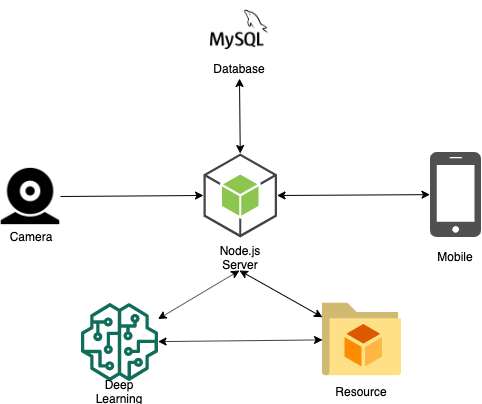

* REST API Server 구축

  * SW 구조
  
    * app: 서버기능
      * api: api 로직을 담당
      * index.js: request를 처리하기 위해 미들웨어들을 모아둔 곳
        * controller.js: 미들웨어에서 받은 내용을 처리해주는 곳
      * config: 서버가 구동하기 위한 환경변수 정의(상수)
        * models: 데이터베이스 모델링
      * bin: 서버 구동을 위한 코드
        * www.js: 서버구동
        * sync-database: DB 싱크
  * Sequelize를 이용한 ORM 사용
  * multer를 이용한 local storage 접근
  
* 환경의 분리

  * 테스트때문에 서버가 실행되는 모드를 몇개 정의해야합니다. 테스트를 할 때 DB를 연결하게되면 DB 테스트에서 사용한 데이터들이 쌓이게 됩니다. 따라서 테스트용 데이터베이스가 따로 있어야 하는데 이것을 위해 서버 환경을 분리할 것입니다.

  * 저희는 두가지 모드를 사용했습니다.

    -development

    -test

    "development"는 개발모드입니다. 평소 개발할 때 쓰이는 환경입니다.

    "test"는 test환경입니다. 코드가 제대로 돌아가고 있는지 mocha를 통해 TDD용으로 만들어뒀습니다.

    이러한 환경정보는 /app/config/environment.js 에 구현했습니다.

    ```javascript
      const environment = {
      development: {
          mysql: {
          username: 'root',
            password: '',
            database: 'now_u_see_me'
          }
        },
        test: {
          mysql: {
            username: 'root',
            password: '',
            database: 'now_u_see_me_test'
          }
        },
        production: {
          mysql: {
            username: 'root',
            password: '',
            database: 'NUSM'
          }
        }
      }
      
      const nodeEnv = process.env.NODE_ENV || 'development';
      module.exports = environment[nodeEnv];
    ```

     environments라는 변수를 두어 각 환경 이름에 해당하는 키를 만들었습니다. 그리고 nodeEnv라는 상수에 노드환경변수 값을 할당했습니다. 노드를 실행하기 전에 "Node_ENV = test"라고 실행하면 이값에 "test"라는 문자열이 들어갑니다. 만약 아무것도 설정하지 않았으면 "development"문자열이 들어가게 될 것입니다.

* Mocha를 이용해 TDD구현

  * describe()를 이용해 테스트 suite를 만들고, it()을 이용해 test를 실행하도록 했습니다.

    test검증은 assert를 쓸 수도 있었지만 node.js 공식 홈페이지에서 다른 모듈을 사용하는 것을 권장하고 있기에 **should 모듈을 이용해 서술식 검증 코드를 만들었습니다.**

    마지막으로 **supertest 모듈을 이용해 express 프레임 워크 위에서 api 테스트를 가능**하게 해줬습니다.

* FCM을 이용해 notification 구현

  * FCM 사용 이유
  
    어플리케이션의 알림기능을 구현하기 위해선 현재 서버에서 클라이언트로 알림을 전달할 방법이 있어야 합니다.
  
    그러나 본연의 서버의 기능을 수행하면서 또 하나의 복잡한 알림기능까지 포함하면 서버에 과부하가 걸린다고 판단되었습니다. Google에서 무료로 제공해주는 Firebase Cloud Messaging을 이용하기로 했습니다.
  
* Server Flowchart

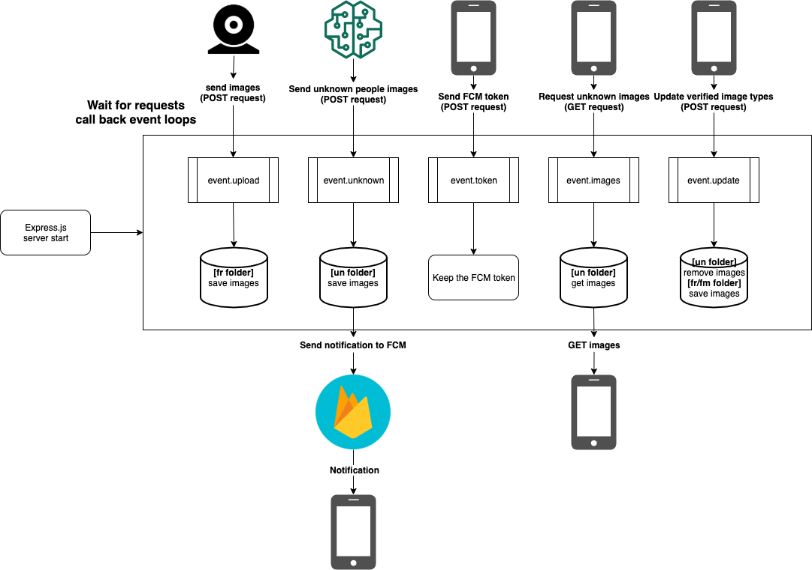


## Story Tour

  #### 1. 개발환경 및 역할

  * 참여인원: 3명
  * 개발분야: REST API Server 개발, 추천시스템 개발 그리고 iOS모바일 어플리케이션 개발
  * 제가 담당한 기술 스택

  

  #### 2. 프로젝트 개요

  한국에 여행온 외국인들을 위해 한국의 재미있는 곳, 인기있는 곳, 맛집을 개인에 알맞게 추천 및 가이드를 해주는 어플리케이션 입니다.

  #### 3. 프로젝트를 통해 얻은 점

  * MVC, Swift 4 기반 iOS 어플리케이션 개발의 이해
  * Alamofire 기반 REST API 개발의 이해
  * Pandas를 이용한 데이터 전처리 기법의 이해
  * Content Based filtering Algorithm을 통한 추천시스템 알고리즘의 이해 및 구현
  * Collaborative Filtering, Matrix Factorization 의 이해와 사용방법의 이해

  #### 4. 프로젝트에 기여한 점

  * MVC 및 Swift 4 기반 iOS 어플리케이션 개발
  
    * MVC 패턴 적용 이유
    
      프로젝트 특성상 서버에 보내야하는 요청의 종류가 많습니다.
      MVC패턴은 뷰와 컨트롤러는 모델에 의존하지만 모델은 화면표시나 컨트롤러와는 독립적입니다.
      즉, **모델에 대한 작업을 할때 어플리케이션 로직이나 화면상 표현에 영향을 주지않게 하기위해** 채택되었습니다.
    
    * Alamofire 사용이유
    
      이 프로젝트의 iOS파트는 swift코드가 대부분 입니다. Alamofire는 **AFNetworking의 Objective-C코드를 전혀 상속하지 않고 모두 Swift로 새롭게 만들었다**는 점에서 채택하게 되었습니다.
      또한 **response/request 호출, JSON parameter와 response serialization등의 기능을 제공**하고 있기 때문에 HTTP 프로토콜을 이용해 서버에 요청/응답을 하는 이 프로젝트에 꼭 필요한 library 입니다.
      마지막으로 Alamofire는 NSURLSession에 기분을 두고 있습니다. 하지만 NSURLSession으로 작성한 코드는 복잡한데 반해 **Alamofire를 사용하면 복잡한 코드를 작성할 필요가 없어집니다.**
    
    * snapkit 사용 이유
    
      만들기 쉬운 sotryboard를 사용할 수도 있었지만 storyboard의 단점은 코드 유지보수가 매우 어렵다고 판단하여서 snapkit library를 사용했습니다.
      snapkit은 **유지보수가 용이하고 segue를 사용하지않기 때문에 직관적으로 데이터를 전달할 수 있다는 장점**이 있습니다.
    
      <center>[어플리케이션 스크린샷]</center>
    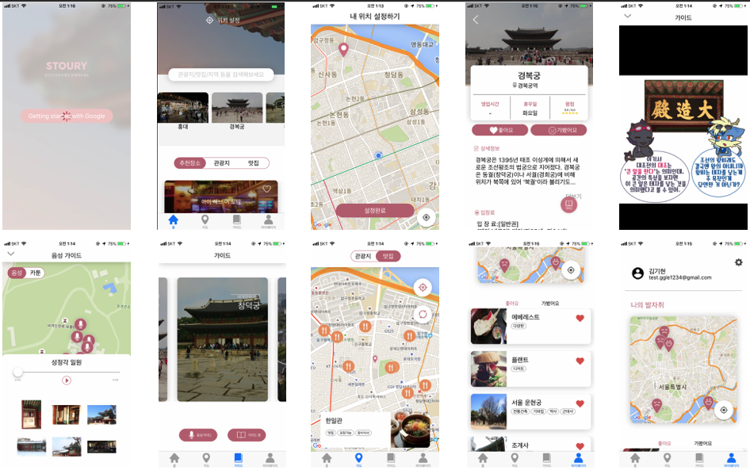
  
* Pandas를 이용한 데이터 전처리, 그리고 Content Based Filtering Algorithm 구현
  
  * 왜 Content Based Filtering 인가?
  
    Content Based filtering은 현재 content와 유사한 항목을 보여주는 추천알고리즘 입니다.
      이 프로젝트에서는 사용자가 보고있는 content에 대한 유사한 항목들을 보여주는 형태로 표현됩니다.
      사용자가 content를 하나만 보게 하는 것이 아닌 여러 content를 볼 수 있음으로 인해 저희 어플리케이션에 머무르는 시간이 많도록 그리고 지루하지 않게 하도록 위합니다.
  
  * 구현 상세 설명
  
    사용자의 feature에 따른 여행지, 음식점을 추천해줘야 합니다.
      그 중에서도 각 여행지, 음식점 등 각 feature들에 대한 TF와 IDF의 곱을 이용해서 만든 Content Based Filtering을 구현 했습니다.
  
    <center>[CB 추천을 위한 코사인 유사도 분석]</center>
  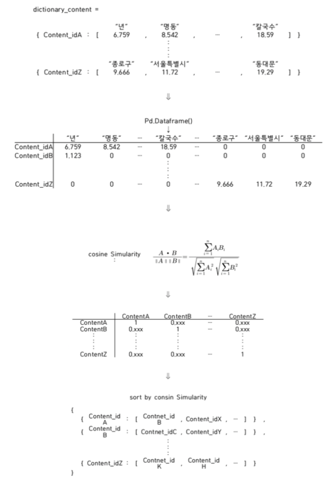

  먼저 content에 대한 한글 형태소를 분석한 뒤 uni, bi, tri gram의 출현빈도를 추출해서 TF를 만들고 이를 이용해 TF-IDF 여행지 행렬을 생성한 뒤 코사인유사도 함수를 이용해 각 content마다 연관성을 행렬로 표현했습니다.
    그리고 이 행렬을 이용해 각 content마다 가장 유사도가 높은 content 순으로 순위를 매겨 실제 어플리케이션에 표출하는 것을 구현했습니다.
      
  
  <center>[CB Filtering의 구현]</center>
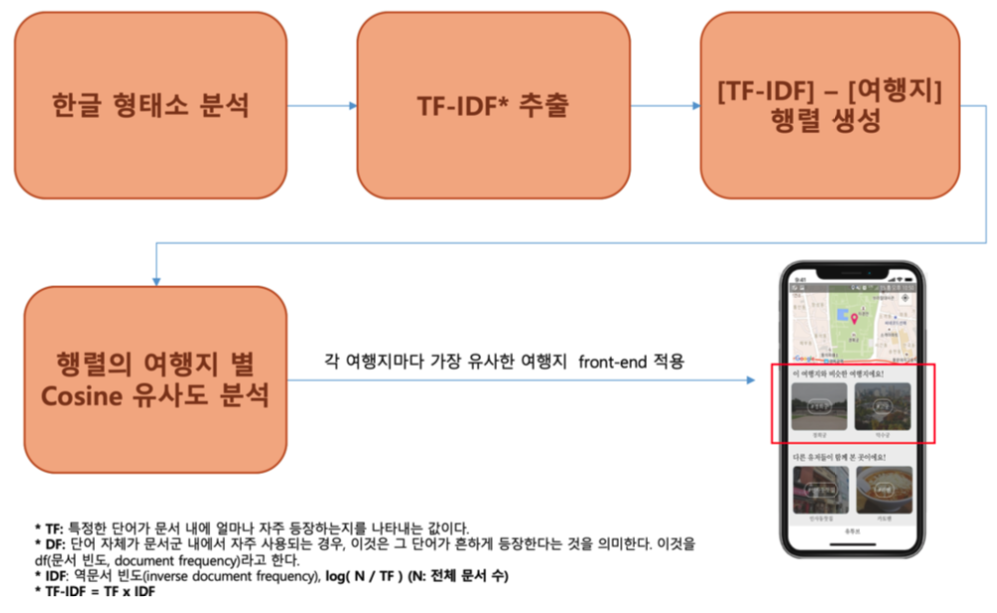
  

  
## TagMusic(학교 프로젝트)

#### 1. 개발환경 및 역할

- 참여인원: 2명
  
  - 개발분야:  Android 모바일 어플리케이션 개발
- 제가 담당한 기술 스택
  
  
  
#### 2. 프로젝트 개요

Tag를 이용해 어플리케이션내에 있는 음악을 관리하는 음악 어플리케이션 입니다.

기존 음악 어플리케이션들의 재생목록은 사용자가 Directory를 생성 후 음악을 집어 넣는 형식입니다.

\#TagMusic은 음악에 Tag를 달아두어서 사용자가 보다 탄력적으로 재생목록을 관리할 수 있게 해주는 어플리케이션입니다.

* 기존 문제점
  
  사용자는 재생목록을 만들 때 가술별, 장르별, 내가 좋아하는 노래별 등으로 만듭니다.
  
  따라서 재생목록을 만들 때 하나의 노래에 여러가지의 재생목록을 만들어야 자신만의 재생목록을 꾸밀 수 있습니다.
  
  예를 들면 "볼빨간사춘기 - 싸운날"노래는 볼빨간사춘기, k-pop, 발라드 3가지의 재생목록을 모두 만들어야 합니다.
  
  또한 재생목록을 수정하려면 직접 재생목록에 있는 음악을 하나하나 수정을 해줘야합니다. 이러한 번거로움을 없애고자 생각해낸게 \#TagMusic 입니다.
  
  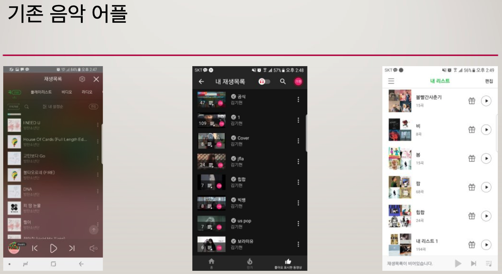
  
  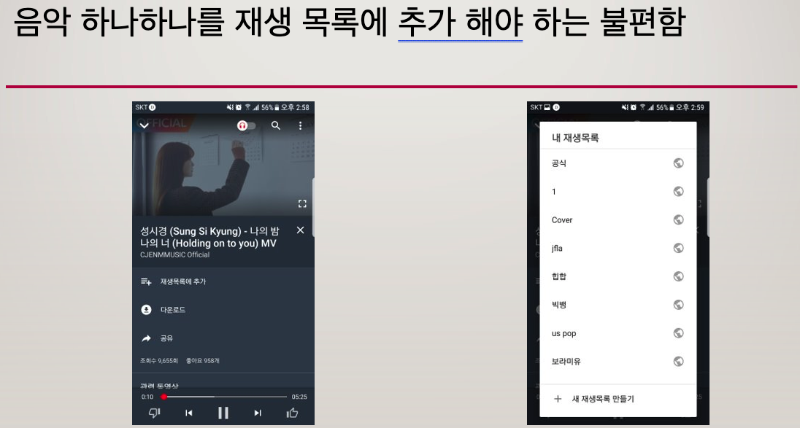
  
  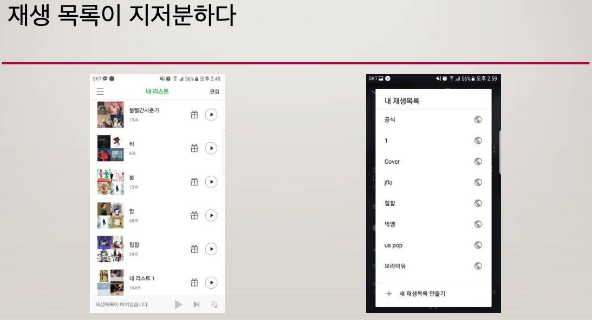
  
  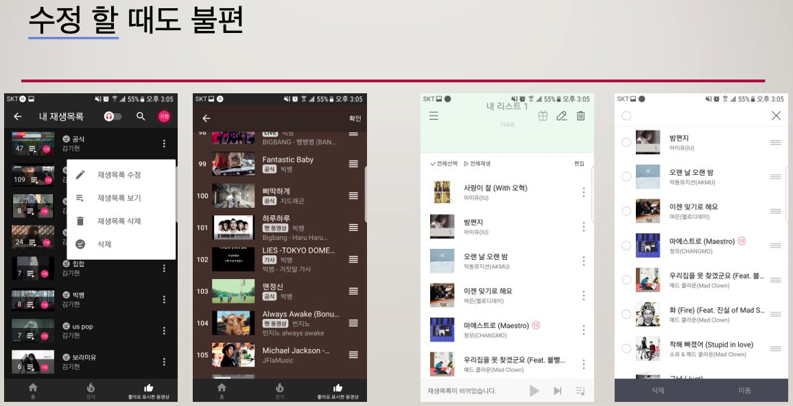
  
  
  

  

  
* 해결
  
  재생목록의 하위에 음악이 있는 것이 아닌 음악(볼빨간사춘기 - 싸운날)에 #볼빨사 #k-pop #발라드 라는 3개의 tag를 달고 "adele = hello"라는 노래에 #adele #pop #favorite라는 3개의 tag를 달았을 때 #발라드 tag를 재생시키면 #발라드가 tagging된 "볼빨간사춘기 - 싸운날", "adele - hello"가 재생되는 형식입니다.
  
  또한 노래를 듣다가 볼빨간사춘기 노래만을 듣고 싶다면 #발빨사 tag만 남겨두면 재생목록이 다시 update되고 특정 가수, 장르의 노래를 들을 수 있습니다.
  
  즉, 재생목록을 단어하나에만 국한 시키지않고 속성을 붙여주는 것입니다. 속성에 음악파일이 들어있는 것이 아니라 음악에 속성을 붙여줌으로서 원하는 음악을 탄력적으로 들을 수 있을 것입니다.
  
  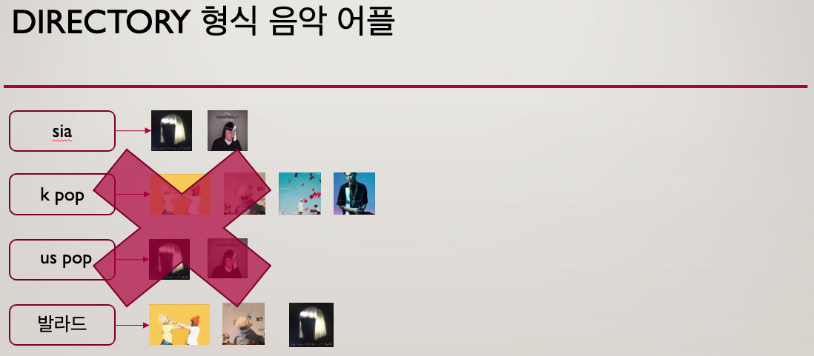
  
  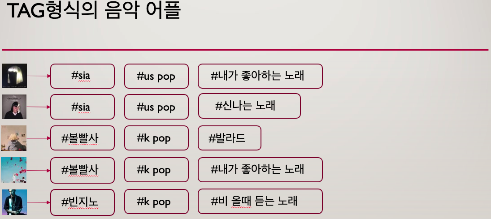
  
#### 3. 프로젝트를 통해 얻은 점

* Java를 기반으로한 Android 모바일 어플리케이션 개발의 이해
  
  * Android의 ORM을 통한 SQLite 핸들링 방법의 이해
* Android service에서 동작하는 기능 개발의 이해
  * Android View 구조의 이해
  * **모바일프로그래밍 과목 A+ 취득**
  
  #### 4. 프로젝트에 기여한 점
  
* Java를 기반으로한 Android모바일 어플리케이션 개발
  
  * PagerView를 이용한 UI 제작
  
    각 View마다 이동이 자유롭게 하기 위해서 PagerView를 이용했습니다. 스와이프만으로도 각 카테고리의 화면을 손쉽게 전환 가능하도록 했습니다.
  
    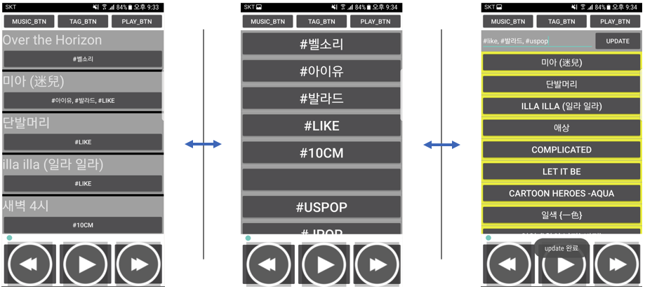
  
    PagerView는 기본적으로 Fragment로 되어있으며 어플리케이션을 구현하기 위해서는 Fragment간에 data이동이 필요합니다.
  
  * TotalMusicManager를 통한 데이터 관리
  
    따라서 모든 정보를 관리하는 TotalMusicManager(이하 TMM)을 만들었으며, Singleton 디자인 패턴을 따릅니다. TMM은 SQLite(DB), storage내 음악파일, UI에 업데이트될 정보를 관리합니다.
  
    <center>[Class구조]</center>
  

  MainAcitivity에서 PagerView를 호출하기 위해 BaseAdaper형태의 pagerAdapder class를 만들었으며 각 카테고리들(music, tag, play)들을 누를 때 마다 그에 따른 fragment가 호출되며, 스와이프로도 화면(frament)이 전환되도록 구현했습니다.
  
  
```java
      @Override
      public android.support.v4.app.Fragment getItem(int position)
    {
        switch(position){
          case 0:
            throw_args.putSerializable("TotalMusicManager", tmm);
            fragment_mf.setArguments(throw_args);
            return fragment_mf;
          case 1:
            throw_args.putSerializable("TotalMusicManager", tmm);
            fragment_tf.setArguments(throw_args);
            return fragment_tf;
          case 2:
            throw_args.putSerializable("TotalMusicManager", tmm);
            fragment_pf.setArguments(throw_args);
            return fragment_pf;
          default:
            return null;
        }
      }
```

  각 fragment는 서로 data를 공유하기 위해 tmm을 MainActivity에서 생성했으며, pagerAdapter에서 각 fragment를 호출할 때 마다 putSerializable()메소드를 이용해 tmm을 넘겨줍니다.

  * SQLite를 통해 DB관리

  * Android service 에서 동작하는 음악재생 기능 구현

    Android의 MediaPlayer 패키지를 이용해서 구현했습니다.

    음악재생 도중 재생목록가 update되는 것을 알기위해 Thread에서 ProgressUpdate를 해줬습니다.

    음악재생을 위한 UI가 MainActivity에 선언 돼있기 때문에 MainActivity의 각 버튼에 setOnclickListener를 달아두었습니다. 각 버튼을 누를 때 마다 setOnclickListener는 trigger가 되어 MediaPlayer의 pause, play, previous, next를 각각 호출하며 음악 재생 도중 일시정지, 재생, 이전 곡, 다음 곡을 구현했습니다.

    


  ## Deeper Deeper

  #### 1. 개발환경 및 역할

  - 참여인원: 4명
  - 개발분야: Unity3D Game
  - 제가 담당한 기술 스택

  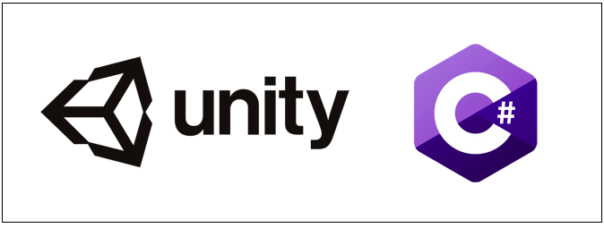

  #### 2. 프로젝트 개요

  Deeper Deeper는Google Play Store에 출시된 게임입니다. 제목과같이“더욱깊이내려가자”라는 기록경쟁 아케이드게임입니다. 게임의 UI테마는 복고풍느낌을 주기위한 도트그래픽을 사용하였고, 이 게임은 바다에서 어부가 낚시를하고, 플레이어는 어부가 되어, 낚시바늘을 최대한 깊이내려가는 것으로 기록을 경쟁하는 것이 주목적입니다. 부수적인 목적으로는 희귀한 물고기들을 잡아 어항에 컬렉션하는 것이 있습니다.

  https://m.apkpure.com/deeper-deeper/com.Lingking.DeeperDeeper#&gid=1&pid=1

  #### 3. 프로젝트를 통해 얻은 점

  * Unity3D를 통한 어플리케이션 UI 제작
  * Colider의 interrupt를 관리할 줄 알며, 충돌처리의 기초를 배웠습니다.
  * Google Play Store 누적다운로드 수 4천명을 달성했습니다.

  #### 4. 프로젝트에 기여한 점

  * 물리적 움직임을 구현하기 위한 가속도, 관성 알고리즘 구현
    * 물리적 움직임을 게임의 컨트롤 요소로써 기획하여, 게임을 진행하는 것에 숙련된 제어를 요할 수 있도록 가속도와 관성을 구현하였습니다.
    * 가속도 및 관성 구현 방법에는 자연로그 함수를 사용하여 시간(사용자가 화면을 터치하고 있는 시간)의 증가에 따라 자연로그 함수의 기울기와 같은 속도 증가 및 감소폭을 구현하였습니다.
  * 어항내에서 팝업창이 띄어질 때 어떤 팝업창인지 알수가 없어서 각각의 버튼들마다 확인과 취소버튼에 대한 정의를 따로 내려줘야 했습니다.
    * 이같은 문제를 enum으로 popstate를 만들어줘서 팝업창이 어떤 상태인지 state를 통해 알 수 있기에 확인버튼에는 state의 값에 따라서 동작하도록 구현하였습니다.
  * 어항내 물고기들의 크기가 제각각이어서 depth에 따라서 큰 물고기 뒤에 작은 물고기가 가려져 카메라에 비춰지지 않는 경우가 있었습니다. 또한 물고기 크기가 sort되어 있지 않아서 다시 한번 해줘야하는 비효율성을 야기했습니다.
    * 물고기들을 prefab으로 만들어서 각 물고기들의 prefab정보를 가져와서 이미지정보를 직접 추출한 후 크기를 이용해 정렬을 했습니다. 물고기가 큰 순서대로 맨뒤에서 부터 배치되었고, 물고기 크기는 sort되어 있기 때문에 따로 추가적인 연산을 하지 않게 되었습니다.

  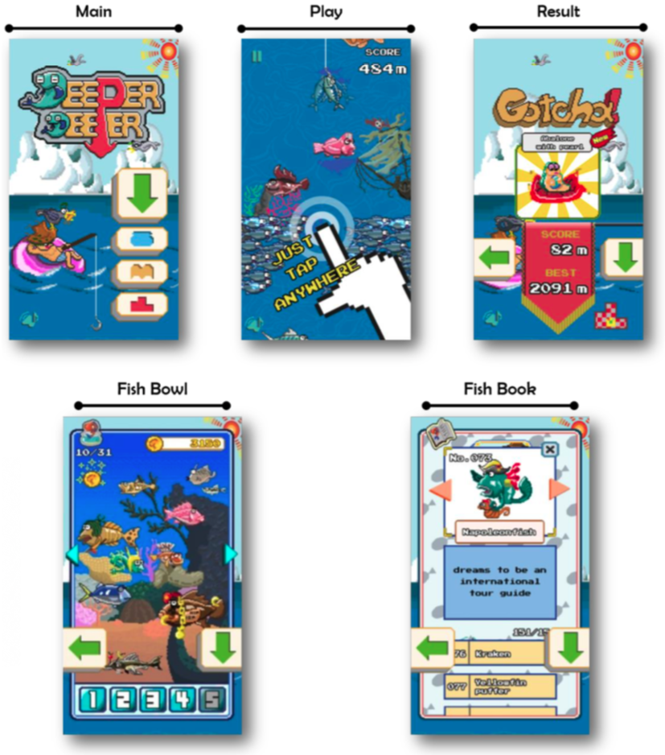

  ## KidsLay: 스쿨존용 IoT기반 차량과속경보 시스템

  #### 1. 개발환경 및 역할

  - 참여인원: 2명
  - 개발분야: Embedded System, Linux application
  - 제가 담당한 기술 스택

  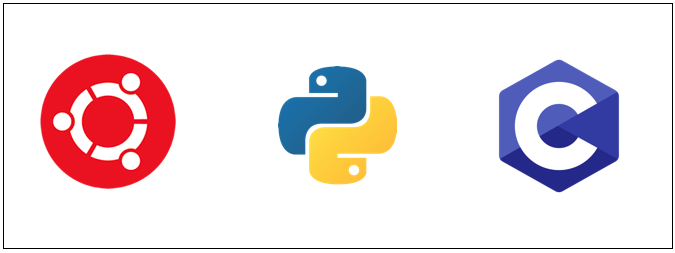

  #### 2. 프로젝트 개요

  2016.06 ~ 2017.08 기간동안 **(주)퀀텀게이트에서 산업자원통상부 지역산업 창의융합 R&D과제로 참여했던 프로젝트** 입니다.

  <center>**회사 보안상의 이유로 자세한 내용은 생략되어 있습니다.**</center>
  * 운행 속도에 따라 달라지는 레이저 동영상을 도로위에 디스플레이 한다.
  * 디스플레이된 레이저 영상을 통해 아이를 칠 수 있다는 경각심과 죄책감을 불러일으킨다.
  * 운전자 스스로 속도를 줄일 수 있도록 동기부여 하는 제품이다.
  * 차량의 속도정보와 시간 정보를 AWS에 저장함으로서 IoT, IoE등 응용분야에 접목이 가능하다.

  #### 3. 프로젝트를 통해 얻은 점

  * Python의 multiprocessing의 이해와 멀티 프로세싱에서 일어날 수 있는 교착상태 문제 해결 방법
  * Python에서 호출가능한 C언어 함수
  * Radar와 Laser의 물리적인 이해
  * RS-232 통신의 이해와 프로토콜 설계및 분석 방법

  #### 4. 프로젝트에 기여한 점

  * 유지보수를 위한 구조화

    Main 어플리케이션을 시스템 흐름, 구조 와 실제 기능으로 나눴습니다.

    시스템 흐름 및 구조는 Python과 multiprocessing을 이용해서 구현했고, main PC와 H/W 모듈들은 RS-232로 연결되어 있습니다.

    기능은 c언어로 구현되어 MCU에 Embedded되어있습니다.

    python의 Cytpes/cdll을 이용해 서브루틴을 호출했습니다. 덕분에 구조적으로도 system control은 python, 실제 동작은 C로 명확하게 구분이 가능하며, 서브루틴을 호출하는 방식이기에 재사용성, 유지보수에도 많은 이득을 취했습니다.

    